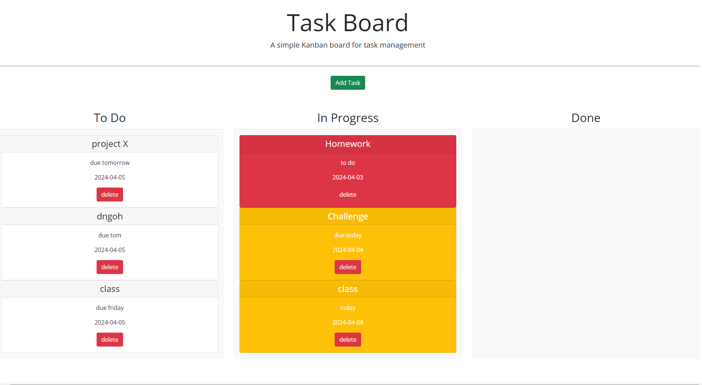

# task-board
# personal-blog

Challenge 5 
## Task Board

Description: What we leared
-How to use Third Party API's dynamically in JavaScript
-How use Jquery and Bootstrap in code
-Diffrences in using 3rd party API's vs vanilla JavaScript

## User Story
* As a developer 
* I want to create a task board
* SO THAT I can learn the benefits of third party API's

## Acceptance Criteria 
* GIVEN a task board
* WHEN I create a modal
* THEN I will be given a form to fill
* WHEN I fill the form
* THEN I will recieve a card with title, description, and a due date followed by a color response tied to the due date
* When the task is "in progress" or "done
* Then I can move the card and snap it into its respective status and delete it from local storage once completed

## Usage
Github Page
https://chrisduffey.github.io/task-board/

Repository URL
https://github.com/chrisduffey/task-board

Page URL
http://127.0.0.1:5500/repos/task-board/index.html

## Mock-up
